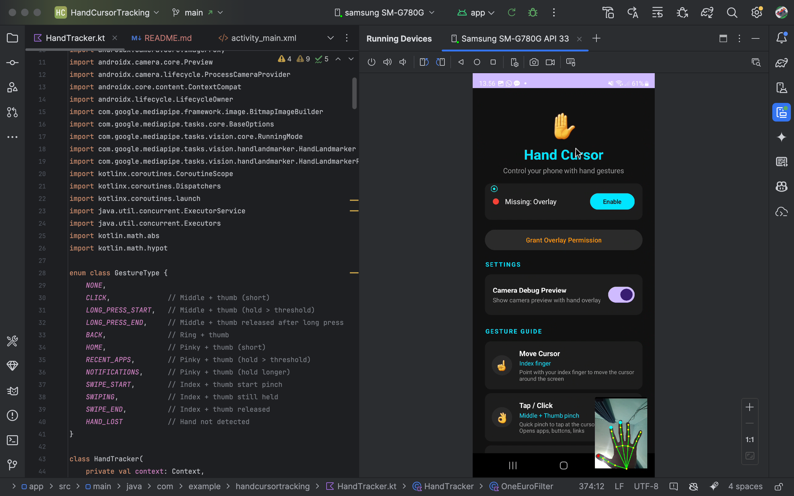

# Hand Cursor Tracking (Android Accessibility Service)

This project provides a hands-free accessibility control interface for Android devices. Utilizing the front-facing camera and Google's MediaPipe Hand Tracking, it allows users to control the on-screen cursor and perform various system gestures entirely through hand movements.

### Inspiration

This project is inspired by **[Gaming with muscular dystrophy | Project GameFace featuring Lance Carr | Google](https://youtu.be/WKr8qOJvNas)**, which brings hands-free head movement gaming to life.

---

## Preview

## Features & Supported Gestures

You can control your Android device using specific hand gestures detected by the front camera.

- ☝️ **Move Cursor (Index finger):** Point with your index finger to move the cursor around the screen.
- 👌 **Tap / Click (Middle + Thumb pinch):** Quick pinch to tap at the cursor position. Opens apps, buttons, links.
- ✊ **Long Press (Middle + Thumb hold >0.5s):** Hold the pinch for 500ms to trigger a long press. Context menus, drag icons.
- 👆 **Swipe / Scroll (Index + Thumb pinch & drag):** Pinch, hold, move your hand, then release. Scrolls pages, swipes between screens.
- 👈 **Back (Ring + Thumb pinch):** Quick pinch to go back. Same as Android back button.
- 🏠 **Home (Pinky + Thumb pinch):** Quick pinch to go to home screen.
- 📱 **Recent Apps (Pinky + Thumb hold >0.5s):** Hold the pinch to open the app switcher.
- 🔔 **Notifications (Pinky + Thumb hold longer):** Hold the pinky pinch extended duration to open the notification drawer.

## Setup & Requirements

- **Camera Permission**: Required for capturing hand movements using the front camera.
- **Display over other apps (Overlay)**: Required to draw the cursor and gesture feedback labels on the screen.
- **Accessibility Service**: Required to perform system-level actions (click, swipe, global actions like Home/Back).

## Technology Stack

- Language: Kotlin
- Computer Vision: [MediaPipe Tasks Vision (Hand Landmarker)](https://developers.google.com/mediapipe)
- Android API: CameraX, AccessibilityService, WindowManager
